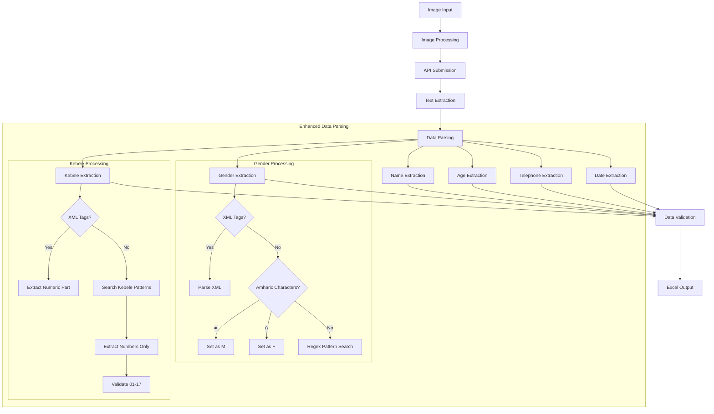

# Medical Card Data Extraction

This Python application processes images of medical cards and extracts key information into Excel format.

## Extraction Flow



## Key Features

- Process medical card images (JPG, PNG) from a directory
- Extract data fields: patient name, age, gender, telephone, kebele, date
- Handle Amharic text, including special handling for gender characters:
  - ወ (wä) → M (male)
  - ሴ (se) → F (female)
- Extract only numeric values from kebele field, ignoring text like "ቀ" or "bdr"
- Output structured data to Excel based on predefined templates
- Comprehensive error handling and logging

## Technical Details

- Uses OpenAI's o4-mini model via OpenRouter API
- Processes images in batch (approx. 100 cards)
- Validates all extracted data fields
- Generates Excel output in standardized format

## Quick Setup (Windows)

1. Run `setup.bat` to:
   - Create necessary directories
   - Set up a virtual environment
   - Install dependencies
   - Create a sample .env file

2. Edit the `.env` file with your OpenRouter API key

3. Place your medical card images in the `images` directory

4. Run `run.bat` to execute the script

5. Check the `output` directory for the generated Excel file

## Manual Setup

1. Create a virtual environment:
   ```
   python -m venv venv
   ```

2. Activate the virtual environment:
   ```
   # Windows
   venv\Scripts\activate
   
   # Linux/Mac
   source venv/bin/activate
   ```

3. Install dependencies:
   ```
   pip install -r requirements.txt
   ```

4. Create a `.env` file from the example:
   ```
   cp env.example .env
   ```

5. Edit the `.env` file with your OpenRouter API key

6. Generate a template Excel file (optional):
   ```
   python create_template.py
   ```

7. Place your medical card images in the `images` directory

8. Run the script:
   ```
   python main.py
   ```

## Project Structure

- `main.py`: Main script coordinating all operations
- `config.py`: Configuration settings from environment variables
- `image_handler.py`: Image processing functions
- `api_handler.py`: API communication with OpenRouter (using o4-mini model)
- `data_parser.py`: Age data extraction using XML-style tags
- `excel_handler.py`: Excel operations
- `logger.py`: Logging configuration
- `env.example`: Example environment variables
- `setup.bat`: Windows setup script
- `run.bat`: Windows run script
- `create_template.py`: Script to generate Excel template

## Fields Extracted

- Age (only)

## XML Tag Format

The system prompts the AI model to return data in XML-style tags:
```
<age>42</age>
```

This format makes parsing more reliable.

## Troubleshooting

If you encounter installation issues:
1. Make sure you're using a compatible Python version (3.8+ recommended)
2. Use a virtual environment
3. Try updating pip: `python -m pip install --upgrade pip`
4. Install packages individually if needed

## Logging

Logs are stored in `app.log`