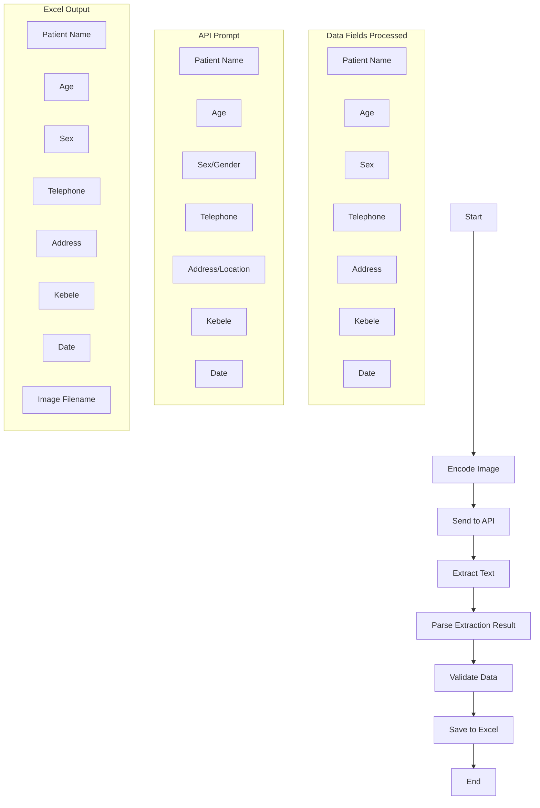

# Medical Card Data Extraction Workflow

## Updated Workflow (Card Number Removed)

## Changes Made:

1. **API Prompt**: Removed card number from the prompt and updated numbering for remaining fields
2. **Data Parser**: Removed all card number extraction and validation logic
3. **Excel Output**: Removed card number column and adjusted column indices
4. **Main Processing**: Updated validation checks to no longer check for card number
5. **Template Creation**: Updated template to no longer include card number column

## Files Modified:

1. `api_handler.py` - Removed card number from the prompt
2. `data_parser.py` - Removed card number parsing and validation
3. `main.py` - Removed card number from validation checks
4. `excel_handler.py` - Removed card number from Excel output
5. `create_template.py` - Removed card number from template creation 